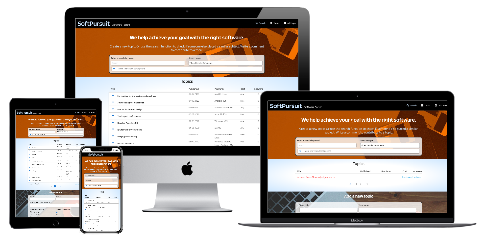

# SoftPursuit

### A simple forum to choose the right software for your needs

Live website: https://ci-ms3-software-forum.herokuapp.com/

This project is for educational use only.

# UX
## User stories:
- I would like tips when choosing a new software
- I want to know what kind of software other people are using for a specific use case
- I have tried different software and would like to share my experiences

## Strategy
A forum-type web page where users can post a goal/use case what they want to achieve with software. Other users can write answers and rate the given answer.

## Scope

Besides posting a goal (split in 'title' and 'details'), users can select the preferred platform/OS, and state if they are
willing to pay for software.

Other users can add an answer, and/or rate other answers with a thumbs up/down system. The answers are sorted by popularity.
The users can search for a topic, and sort the list according to creation date descending or ascending. In addition, there
are more filter options:
- Platform
- pay/free
- Answers (yes/no)

Multiple filters can be applied at the same time. The page is fully responsive to work on desktop and mobile

## Structure

### The page has the following html structure:
1. Home page with 3 sections:

    - Search: With different search and filter options
    - Topics: Showing a table of topics (max. 10 per page with the use of pagination)
    - New Topic: Input form to create a new forum topic. Making it as easy as possible for people to add a topic by keeping the form on the home page

2. New page with a form for changing a topic

3. Two separate pages to display backend error messages

Header with a logo and tagline (fixed), and a footer with social links

### Database: MongoDB

#### One collection is used (topics):

| Key in collection  | Data type   | Purpouse                                                |
| ------------------ |-------------| ------------------------------------------------------- |
| _id                | ObjectID    | Unique identifier of document                           |
| title              | string      | Title of the topic (max 40 chars)                       |
| details            | string      | Detail description of topic (max 400 chars)             |
| author             | string      | Name of topic author (max 40 chars)                     |
| os                 | array       | OS (1 or more strings) selected by the user             |
| cost               | string      | One out of three values: Any/Free/Paid                  |
| publish_date       | date        | Timestamp when user creates new topic                   |
| comments           | array       | Containing the comments as objects (see following table)|

#### Comments array objects:

| Key in object      | Data type   | Purpouse                                                |
| ------------------ |-------------| ------------------------------------------------------- |
| comment_text       | string      | Comment text (max 400 chars)                            |
| comment_author     | string      | Name of comment author (max 40 chars)                   |
| comment_pos        | int32       | Counting positive ratings (thumbs up)                   |
| comment_neg        | int32       | Counting negative ratings (thumbs down)                 |
| popularity         | int32       | comment-pos minus comment_neg (used for sorting)        |
| expired            | bool        | Turns 'true' when topic gets changed                    |
| comment_id         | string      | Unique identifier, used when sorting by popularity      |

## Skeleton
[Wireframe](/attachments/wireframe.pdf)

## Surface
- Simple yet memorable color scheme, without distracting from the content: (orange, light-blue, black, white)
- All text input fields have a white background
- Dark blue signalizes interaction (clickable) or a selection
- Light blue is the background of an active topic
- Use 2 fonts: Blinker for titles and logo, and Mukta for everything else
- Use fontawesome icons when appropriate
- Use of pictures that fit the described color scheme

# Features

### Current Features
- Show topics from a database, display them with pagination
- Adding, editing and deleting a topic
- sorting/filtering topics according to:
    - date (ascending and descending)
    - Platform
    - cost
    - Answered / unanswered (Did anyone comment the topic)
- Searching for a topic with keyword(s) in title, details and comments (selectable)
- Adding comments to a topic
- Rating comments: They are being sorted according to their popularity (most popular first)
- Comments are marked 'Expired' when the topic was edited after the comment was written
- Show a progress bar (Materialize infinite preloader) at the top of the page when waiting for data

### Planned Features
- Important: User authentication, so that users can edit and delete only their own topics
- Allow users to change and delete comments
- Search for names (author)in comments and topics
- Fixing the issues addressed in the 'Testing' document

# Technologies used
- HTML
- CSS
- JavaScript
- Python
- Pymongo
- Flask
- Jinja
- Materialize
- (jQuery 3.4.1 (jQuery.com) to access DOM elements quicker, and react to user input)
- Google Fonts (fonts.google.com) for 2 fonts
- Fontawesome for icons
- GitPod (gitpod.io) IDE
- GitHub (github.com) for sharing
- Git (for version control)
- MongoDB
- Heroku

# Testing

## Testing write-up

I ran the code through validation services
(https://validator.w3.org/, http://jigsaw.w3.org/css-validator/ and https://jshint.com/).
Please refer to the separate document [testing](/attachments/testing.md) for more details regarding
manual testing. Issues that need to be fixed in the future but don't affect the current main-functionality
are boxed and marked with a warning-sign ()

## Challenges

### Jinja/Flask/Javascript

Sometimes the behavior of the different languages was unexpected. For example:
- I had to quit the habit of putting code in comments in  html files for testing, because a comment containing Jinja (
{{ or }} ) is being read as code, and not as a comment
- Not all JavaScript is being read when it's in a separate file. Therefore, I had to add JavaScript to the html files
directly in some cases, otherwise it would never get called. Overall, that makes the code less readable 

### Structure

The project was a challenging learning experience to show the importance of careful planning at the beginning.
For every functionality, it's important to know which approach would work better after access to the database
in Python:

1. Refreshing the page (with html form action and arguments)
2. Update the page without refreshing (with the help of JavaScript)

The project is now a mix of both, which serves me as a reference for future projects. But, it makes the code more
difficult to read and it was extremely time consuming to change functions from one approach to the other. The UX
could be more consistent with careful planning, but it would have consumed too much time to change the code (which
in many cases would mean to change a lot of the basic structure)

For the future: Even though the database used is not relational, it would have been helpful to create a flowchart
to help with the structure. With this project, it will be difficult to implement user validation in the future,
because there need to be 2 MonboDB collections (one for topics, and one for comments), in order to work properly.

### Materialize

I've used Materialize to get familiar with it. But I realized that Materialize is not as mature yet as Bootstrap,
which probably would have been a better choice. There was a lot of unexpected behavior (certain
margins and padding, the icons, 'hidden' color in forms, etc). In addition, it's much more difficult to find
specific solutions when searching on the internet, Bootstrap seems to have a bigger user base.

Particularly for form elements, looking back, it probably would have been easier to build on the html defaults
rather than changing the Materialize styles, considering that I went a completely different way in styling than
proposed by Materialize.

Further on, it was a challenge to use elements in rows of a collapsible which are build by iterating. Materialize
often uses css id's as a reference, and not a class. But using a class often is the only option, otherwise the same
id is more than once in the document. An example for that is the modal popup (used when clicking on the 'Edit topic'-
button).

# Deployment

## Create a local repository

Make sure you have [Python 3](https://www.python.org/), [PIP](https://pip.pypa.io/en/stable/installing/) and [Git](https://git-scm.com/) installed before applying the following steps:

1. Click on the green button 'Clone or download' above and unzip the downloaded zip-folder, or use the following terminal command to paste the repository into your IDE:   
`git clone https://github.com/andreasjost/CI-MS3-Software-Forum`  

2. Create a new database in [MongoDB Atlas](https://www.mongodb.com/). 

3. Set up environment variables:
    - Create file: 'env.py' in your root directory.
    - Add the command `import os` at the beginning of 'env.py' to set the environment variables.
    - Connect your MongoDB database(MONGO_URI) by adding the following command to env.py:   
    `os.environ["MONGO_URI"] = "<link to your MongoDB database>"`  

4. Install all requirements from the 'requirements.txt' by using this terminal command:   
`pip3 install -r requirements.txt` or `sudo pip3 install -r requirements.txt`, depending on your IDE   

## Deployment of project
The project is deployed on [Heroku](https://heroku.com/) following these steps:
1. Create file: 'requirement.txt', containing a list of dependencies needed for the project, by typing the following terminal command:  
`pip3 freeze > requirements.txt`
2. Create file: 'Procfile' (mandatory for Heroku in order to define the starting point), with the command:   
`echo web: python run.py > Procfile`
3. Push the files to the GitHub repository with the commands:
    - `git add .` (or type out the filenames instead of '.')
    - `git commit -m "your message"`
    - `git push`
4. Open [Heroku](https://heroku.com/) and create a new app with a new unique name and the preferred region
5. Login to Heroku in your IDE with the command
`heroku login  -i`, the Heroku username and password are required
6. Push the project to Heroku with the command:   
`git push heroku master`

7. To start the web process, put the following command into the terminal: `heroku ps:scale web=1` to scale dynos
8. Go back to your app in Heroku in your browser, select the 'Settings'-tab, click on "Reveal Config Vars"
and set the following config vars:
    - IP: 0.0.0.0
    - PORT: 5000
    - MONGO_URI: `<link to your MongoDB database>` (must be the same as in your file env.py)
    - DEBUG: FALSE 

9. Click on the "Open app" button in Heroku to view the deployed app.   

## Credits

### Media
The photos used are from pixabay.com.

### Code
Besides the Code Institute Walkthrough projects, I often consulted the following sites:
- stackoverflow.com (for many general issues)
- w3schools.com (mainly to refresh python syntax)
- mongodb documentation, mainly: https://docs.mongodb.com/manual/tutorial/query-array-of-documents/ in order to work with arrays
- Youtube tutorial https://www.youtube.com/watch?v=Kcka5WBMktw (part 1) and https://www.youtube.com/watch?v=A291yJ92154 (part 2)
by "Pretty Printed": learning how to update the page without refreshing

Thanks also to my Code Institute mentor for the helpful input.