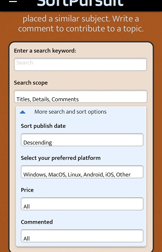

# Testing

## Manual testing of functionality

### Opening page:
- Topics are fetched from monbodb and displayed in the 'topics-section'

### Pagination
- Only a limited number of topics are displayed
- On the first and last page, the arrow left and right ( < > ) respectively is not active
- Active arrows left and right ( < > ) work and render 1 page forward or backward
- Choosing an inactive page number jumps to the corresponding page
- Pagination-links are hidden if the page number <= limit (checked by applying a search)

### Navigation
- The three navigation links 'Search', 'Topics', and 'Add topic' work, page jumps to the right section
- Click on the logo jumps home ('Search'-section)
- Social-links in the footer

### Search
- Searching the database when entering one or more search keyword(s)
- Search ignores lowercase/uppercase entry
- Selection 'Search scope': selecting/deselecting the different items
- Link 'Reset search options" clears the previous input
- Clicking on "More search and sort options" shows more options
- Check out all the extra options one by one
- Check extra option in combination with a search keyword
- Every individual option/entry stays selected and works in combination
- Pagination works correctly after every change in the search
- If no items were found, an error appears
- Materialize Preloader is displayed when the user has to wait for database feedback
> Selecting the collapsible header 'More search and sort options'
only works when clicking on text or the blue arrow, but not in the entire header. Border issue.

### Topics-list

- Materialize collapsible opens and closes topics correctly when clicking on it, the blue arrow changes (up/down)
- The details and comments are shown in an open (active) topic
- Button 'Delete topic' deletes the topic from the database
- Button 'Edit topic' opens a new page with the edit-from
    - the 'Home'-button brings me back to the homepage
    - the 'Update'-button saves the changes I made to the topic
    - Error handling when an input is invalid (see chapter 'Defensive Programming' for details)
- Rating (Thumbs up and down) works
    - The user an rate up or down only once per comment, to avoid boosting that comment. A 2nd click/tap on the thumbs icon removes
    the rating, in case the rating was done accidentally
    - after re-loading the topics (eg. through pagination), the comments appear sorted according to their popularity
- Button 'New comments' opens a form to enter a new comment
    - 'Cancel'-button closes the comment-form again
    - 'Save'-button saves the comment top the corresponding topic
    - Error handling when an input is invalid (see chapter 'Defensive Programming' for details)

Corrected issue: Topic is deleted without warning. Added a delete-warning

> After the error handling in case of invalid input
(comments and topics), the form disappears and the content is cleared. The error page should be a pop-up
rather than a separate html page

### Add topic

- The 'Save'-button adds the topic to the database
    - Error handling when an input is invalid (see chapter 'Defensive Programming' for details)
    - When returning from the error, the fields are still filled

## Defensive Programming

The project contains different tools to catch invalid user input:

### Frontend

- Javascript alert popup when the user does the following:
    - Enter more than 40 characters in a text fields
    - Enter more than 20 characters in the search field
    - Enter more than 400 characters in a textarea
    - Nothing selected in the search OS/platform-filter

- Defined a maxlength attribute in HTML textareas and text input fields

Corrected issue: Show warning modal (frontent/js) when user enters too many characters

> After dismissing the error message when no os/platform was selected in the search-area, the select-popup closes. It needs to stay open.

### Backend
- Python: A new html file opens, informing the user about the issue:
    - Check that no input fields or text areas are empty
    - Check that at least one platform/os is selected when adding/updating a topic
    - Check the same character limits (40/400) as above

## Testing browsers and screen sizes

| Browser                 | Mobile             | Full-HD | 4K | Changing size dynamically|
| ----------------------- |------------------- | ------- | -- | ------------------------ |
| Chrome (Win + Mac)      | x (dev-tools)      | x       | x  | x                        |
| Firefox (Win + Mac)     |                    | x       | x  | x                        |
| Edge                    |                    | x       | x  | x                        |
| Safari (Mac)            |                    | x       | x  | x                        |
| Safari (iOS)            | x                  |         |    |                          |

### corrected issues related to responsiveness:
- Some of the input and select fields didn't align properly vertically. Fix: Due to time pressure, I solved the issue with
additional wrappers.
- the title "Answers" above the table with the topics was too long on mobile devices. Fix: shortened it to 'Answ' on small screen
sizes with the assistance of Materialize helpers
- The background-image in edittopic.html only covers half the page on mobile devices. Fix: use
'min-height 100vh' instead of 'height: 100vh' for the section

### Other issues

> There is an issue with the Safari browser, both on a Mac and on iOS:
The v-alignment of the search and the 'select'-input fields is not correct, the text is not in the middle (see screenshot below)

> Favicon-issue: when the page 'edittopic.html' and 'errortopic.html'
is rendered, it doesn't show the favicon 

.

